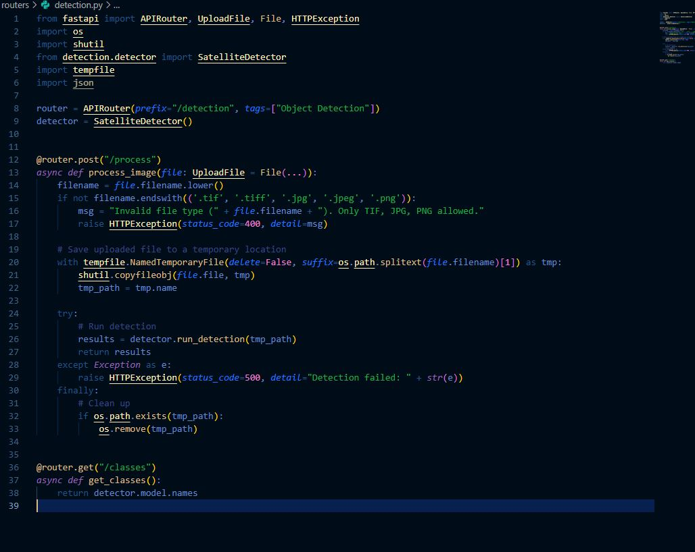

# WebGIS Satellite Object Detection (YOLOv8-OBB)

Repositori ini berisi proyek **Automated Feature Extraction** yang mengintegrasikan kecerdasan buatan (AI) dengan WebGIS untuk deteksi objek otomatis pada citra satelit berformat GeoTIFF.

## 📝 Laporan Praktikum
**Nama:** Febrian Valentino Nugroho  
**NIM:** 123140034  
**Mata Kuliah:** Praktikum SIG (Pertemuan 10)

---

### 1. Tujuan Praktikum
1. Mengimplementasikan pipeline deteksi objek otomatis pada citra satelit menggunakan model Deep Learning.
2. Memahami proses konversi koordinat piksel gambar menjadi koordinat geografis (Latitude/Longitude) menggunakan metadata GeoTIFF.
3. Mengintegrasikan model YOLOv8-OBB dengan framework FastAPI dan React-Leaflet.
4. Melakukan pengolahan citra besar melalui metode Image Tiling untuk efisiensi komputasi.

### 2. Detail Teknologi (Tech Stack)
*   **Backend:** FastAPI (Python) sebagai penyedia layanan API deteksi.
*   **AI Model:** YOLOv8-OBB (Oriented Bounding Boxes) dari Ultralytics. Mampu mendeteksi objek miring (bangunan/kapal) secara akurat.
*   **Geospatial Processing:**
    *   **Rasterio:** Membaca metadata transformasi affine pada file GeoTIFF.
    *   **Shapely:** Mengolah hasil deteksi menjadi geometri poligon.
    *   **GeoJSON:** Format standar transmisi data spasial.
*   **Frontend:** React.js dan React-Leaflet untuk visualisasi di atas peta interaktif.

### 3. Metodologi & Poin Teknis
*   **Image Tiling:** Memecah citra besar menjadi potongan (640x640 piksel) untuk menghindari *memory crash*.
*   **Affine Transformation:** Mengubah koordinat $(x, y)$ piksel menjadi $(Lon, Lat)$ bumi asli menggunakan library Rasterio.
*   **Dynamic Layering:** Merender hasil deteksi secara otomatis sebagai layer poligon di atas basemap.

---

### 4. Langkah Kerja & Implementasi Kode
1. **Setup Environment:** Instalasi library `ultralytics`, `rasterio`, dan `shapely`.
2. **Backend Logic:** Pengembangan file `routers/detection.py` yang menangani upload file TIF, proses inferensi YOLO, dan transformasi koordinat.
3. **Frontend Integration:** Penambahan fitur Upload pada sidebar dan fungsi untuk menampilkan hasil deteksi sebagai objek poligon di peta.

---

### 5. Hasil Pengujian (Dokumentasi)

Berikut adalah hasil deteksi di 5 lokasi strategis di Provinsi Lampung:

#### Figure 1: Bakauheni (Deteksi Kapal & Infrastruktur Pelabuhan)

#### Figure 2: UNILA (Deteksi Gedung & Area Pendidikan)

#### Figure 3: Tanjung Karang (Deteksi Kepadatan Bangunan Pusat Kota)

#### Figure 4: Teluk Betung (Deteksi Pemukiman Pesisir)

#### Figure 5: Natar (Deteksi Area Transportasi/Bandara)

---

### 6. Data Sampel Citra Satelit (GeoTIFF)
Proyek ini menyertakan sampel citra satelit asli (.tif) yang terletak di folder `data/tif_samples/`:
*   `lampung2_unila.tif`
*   `lampung3_tanjungkarang.tif`
*   `lampung4_bakauheni.tif`
*   `lampung5_natar.tif`
*   `lampung8_telukbetung.tif`

Semua file di atas memiliki referensi geografis **WGS 84 (EPSG:4326)**.

---

### 7. Cara Menjalankan Proyek

#### Backend
1. Masuk ke root directory.
2. Aktifkan virtual environment: `.\.venv\Scripts\activate`
3. Jalankan server: `python -m uvicorn main:app --reload`

#### Frontend
1. Masuk ke folder `frontend`.
2. Jalankan: `npm run dev`

---

### 8. Analisis & Kesimpulan
*   **Akurasi Spasial:** File `.tif` sangat krusial karena menyimpan metadata spasial yang tidak ada pada `.jpg`.
*   **YOLOv8-OBB:** Sangat efektif karena objek satelit jarang sejajar dengan sumbu gambar.
*   **Kesimpulan:** Sistem Automated Feature Extraction berhasil dibangun dengan koordinat bumi yang presisi.
